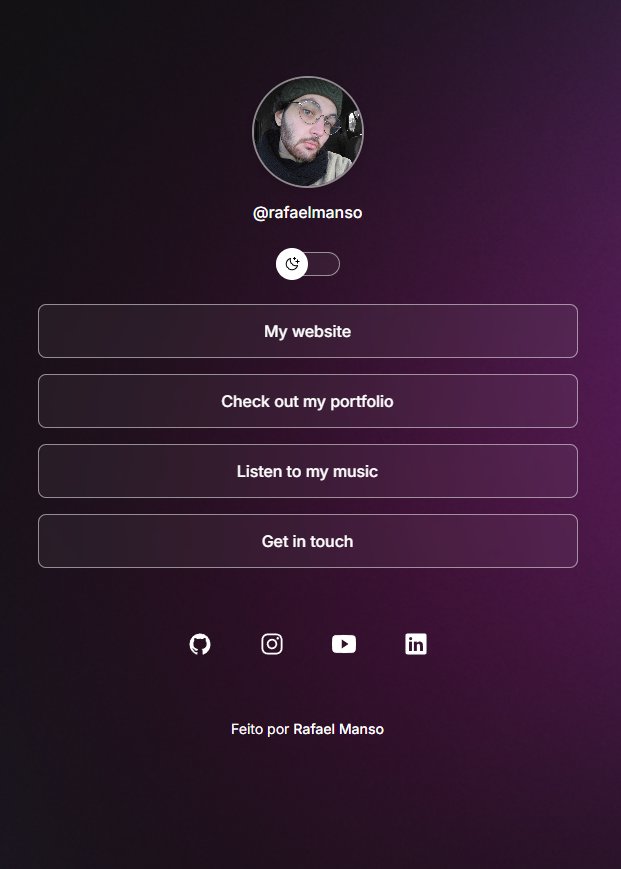
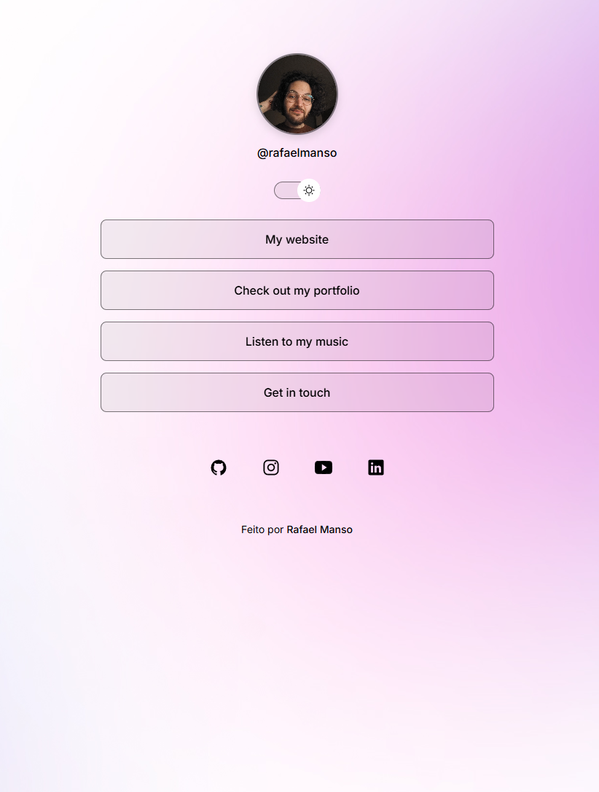

# Artist Links - Link Tree Portfolio

A modern, responsive link tree page with dark/light theme toggle.

## ✨ Features

- 🌓 Dark/Light theme toggle with localStorage persistence
- ♿ Full accessibility support (keyboard navigation, ARIA labels)
- 📱 Responsive design 
- 🎨 Smooth animations and hover effects
- 🔗 Social media links
- 💾 Theme preference saved across sessions

## 🛠️ Technologies

- HTML5
- CSS3 (Custom Properties, Animations)
- Vanilla JavaScript

## 🚀 Live Demo

[View Live Demo]((https://rafaeltmanso.github.io/artist-links/))

## 📷 Screenshots

### Dark Mode

### Light Mode

This project was created as part of Rocketseat's Explorer program.
